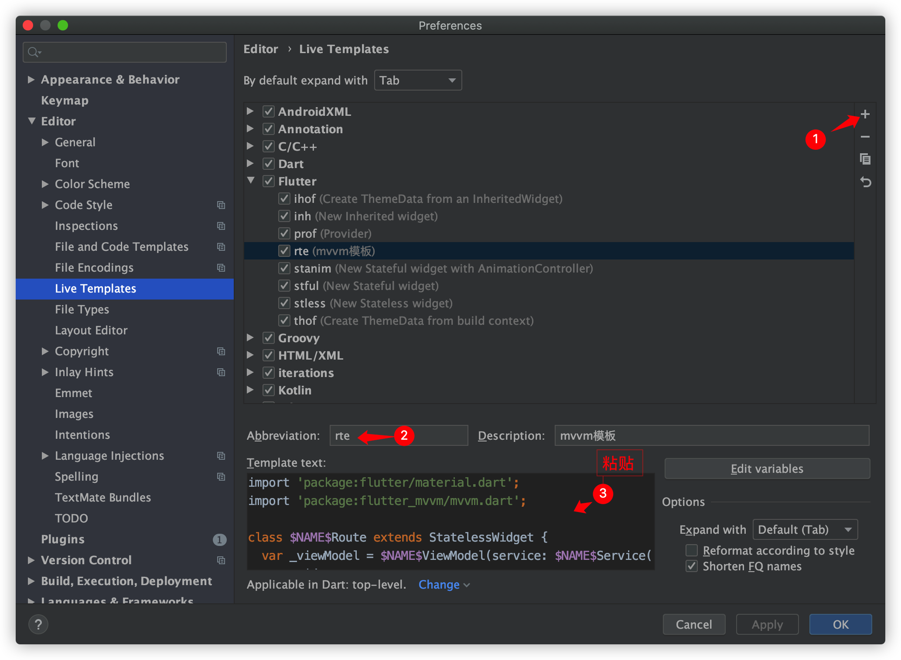

# flutter_mvvm

```yaml
flutter_mvvm:
    git:
      url: git@github.com:forJrking/flutter_mvvm.git
      ref: v0.0.1
```


Mvvm Flutter 模板



```dart
import 'package:flutter/material.dart';
import 'package:flutter_mvvm/mvvm.dart';

class $NAME$Route extends StatelessWidget {
  var _viewModel = $NAME$ViewModel(service: $NAME$Service());
  @override
  Widget build(BuildContext context) {
    return BaseWidget<$NAME$ViewModel>(
      model: _viewModel,
      builder: (context, model, child) => Scaffold(
        appBar: AppBar(
          title: Text($END$),
        ),
        body: Container(
          child: _buildBody(model),
        ),
      ),
      onModelReady: (model) {
        //发起网络请求
        model.demo();
      },
    );
  }

  Widget _buildBody($NAME$ViewModel model) {
    switch (model.state) {
      case ViewState.Success:
        return  Text(model.info);
        break;
      case ViewState.Failure:
      case ViewState.None:
        return Text('Empty');
        break;
      case ViewState.Loading:
      default:
        return Center(child: CircularProgressIndicator());
        break;
    }
  }
}

/// viewModel
class $NAME$ViewModel extends BaseModel {
  $NAME$Service _service;

  $NAME$ViewModel({@required $NAME$Service service}) : _service = service;

  //region ========== 示例 ==========
  String info = '请登录';

  demo() async {
    setState(ViewState.Loading);
    info = await _service.doNet();
    setState(ViewState.Success);
  }
//endregion

}

/// api
class $NAME$Service {
  //接口
  Future<String> doNet() async {
    return new Future.delayed(const Duration(seconds: 2), () => "成功");
  }
}
```

